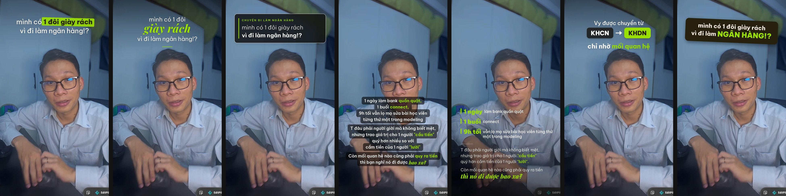

# hook-text — công cụ đặt chữ hook lên video

Dành cho học viên Tự Mình Xây Kênh. Bạn đưa **ảnh chụp frame video** và **nội dung hook**, Claude xem frame, chọn bố cục, render ra 2 đến 3 phương án kèm file để kéo vào CapCut và hướng dẫn dựng lại.

## Cách dùng (trong Claude Code, mở repo này)

1. Chụp màn hình đoạn video bạn muốn đặt hook. Nên cap từ video gốc, không cap từ app đang mở.
2. Gõ cho Claude, kèm ảnh:

   ```
   làm hook text cho frame này, nội dung: mình có 1 đôi giày rách vì đi làm ngân hàng!?
   ```

3. Claude trả về:
   - `contact-sheet.jpg`: các phương án cạnh nhau để chọn.
   - `*-preview.jpg`: từng phương án đủ cỡ.
   - `*-overlay.png`: chỉ có chữ, nền trong suốt. Kéo vào CapCut là xong.
   - `guide.md`: font, cỡ, màu, vị trí % và các bước CapCut để tự dựng khi cần sửa chữ.
4. Chọn một phương án. Nếu muốn, gửi video gốc để Claude xuất MP4 có chữ hiện đúng lúc.

## Dùng script trực tiếp (không cần Claude)

```bash
pip install pillow numpy
cd .claude/skills/hook-text/examples
python3 ../scripts/render.py spec-example.json
```

Sửa `spec-example.json`: đổi `frame` sang ảnh của bạn, sửa `blocks` thành text của bạn. Bảy mẫu và tham số ở `reference/templates.md`.

## Bảy mẫu

`highlight` vệt bút dạ · `editorial` sans + serif nghiêng · `glass` thẻ kính mờ · `sticker` thẻ đen nghiêng · `bubbles` hộp chữ TikTok · `timeline` mốc song song · `chips` từ A sang B



## Font

Be Vietnam Pro và Playfair Display Italic, kèm sẵn trong `fonts/`, giấy phép OFL. Gợi ý cặp font thay thế và thông số ở `reference/fonts.md`.
